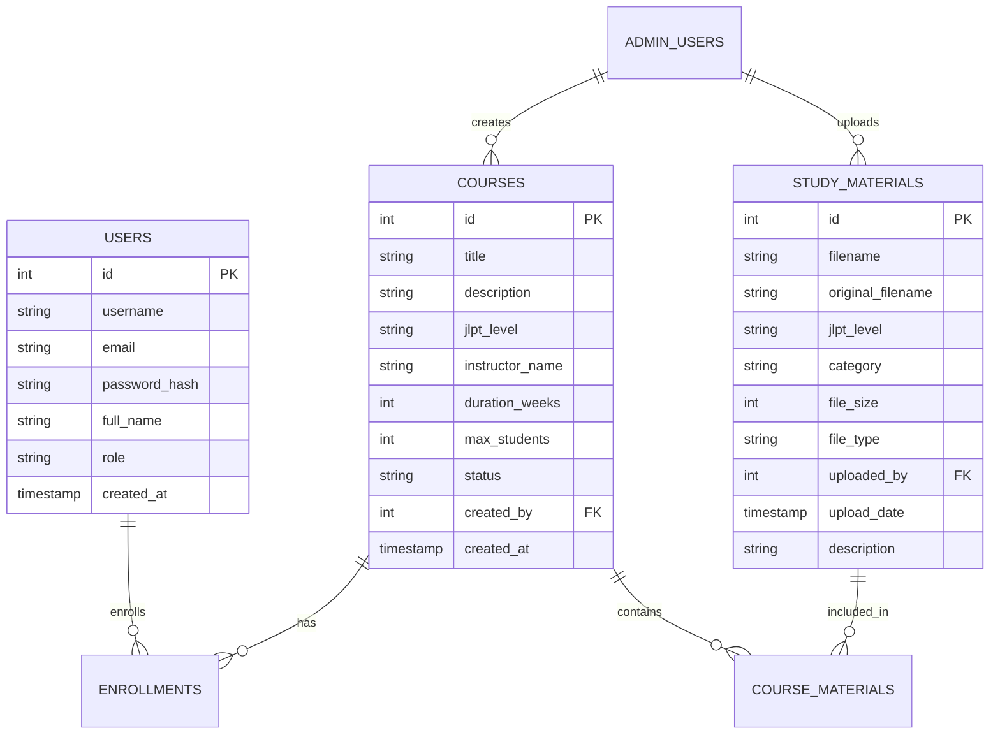

# JLPT Study Materials Platform

<div align="center">
  
  
  
  
</div>

<div align="center">
  <h3>A comprehensive web application for managing and accessing JLPT (Japanese Language Proficiency Test) study materials, courses, and student enrollments.</h3>
</div>

---

## 📋 Table of Contents

- [Features](#-features)
- [Demo](#-demo)
- [Technology Stack](#-technology-stack)
- [Installation](#-installation)
- [Quick Start](#-quick-start)
- [Project Structure](#-project-structure)
- [API Documentation](#-api-documentation)
- [Contributing](#-contributing)
- [License](#-license)

## ✨ Features

### For Students
- 📚 Browse study materials by JLPT level (N5-N1)
- 📖 Access books, reviewers, and audio materials
- 🎓 Enroll in structured courses
- 📱 Responsive design for mobile and desktop
- 👤 User registration and authentication
- 📄 In-browser PDF viewer

### For Administrators
- 🔐 Separate admin panel with secure authentication
- 📤 Upload and manage study materials (books, reviewers, audio)
- 🏫 Create and manage courses
- 👥 Approve/reject student enrollments
- 📊 View system statistics and user analytics
- 🗄️ Bulk operations for materials and courses
- ⚙️ System settings and configuration

## 🎬 Demo

<div align="center">
  <kbd>
    
  </kbd>
</div>

> **Note**: Replace the placeholder image with actual screenshots of your application

## 🛠️ Technology Stack

| Category | Technologies |
|----------|-------------|
| **Backend** |   |
| **Database** |  |
| **Frontend** |     |
| **Libraries** | PyMuPDF, Pillow, Werkzeug |

## 🚀 Installation

### Prerequisites

- Python 3.7 or higher
- pip (Python package manager)
- Git

### 📦 Setup Instructions

1. **Clone the repository**
   ```bash
   git clone https://github.com/charnyladaro/JLPT_Reviewer.git
   cd jlpt-study-platform
   ```

2. **Create a virtual environment**
   ```bash
   python -m venv venv
   
   # On Windows
   venv\Scripts\activate
   
   # On macOS/Linux
   source venv/bin/activate
   ```

3. **Install dependencies**
   ```bash
   pip install -r requirements.txt
   ```

4. **Initialize the database**
   ```bash
   python app.py
   ```
   The database will be automatically initialized on first run.

5. **Run the application**
   ```bash
   python app.py
   ```
   The application will be available at `http://localhost:5000`

## ⚡ Quick Start

Want to get started quickly? Follow these commands:

```bash
# Clone and enter directory
git clone https://github.com/yourusername/jlpt-study-platform.git && cd jlpt-study-platform

# Create virtual environment and activate it
python -m venv venv && source venv/bin/activate  # On Windows: venv\Scripts\activate

# Install dependencies and run
pip install -r requirements.txt && python app.py
```

Then open your browser to `http://localhost:5000` 🎉

Create a `requirements.txt` file with the following content:

```txt
Flask==2.3.2
Werkzeug==2.3.6
PyMuPDF==1.23.3
Pillow==10.0.0
python-dateutil==2.8.2
```

## 🔐 Default Credentials

### Admin Panel Access
| Field | Value |
|-------|-------|
| **URL** | `/admin` |
| **Username** | `admin` |
| **Password** | `admin123` |

> ⚠️ **Security Warning**: Change these credentials immediately after first login!

## 📐 Project Structure

```bash
jlpt-study-platform/
│
├── 📱 app.py                    # Main Flask application
├── 📋 requirements.txt          # Python dependencies
├── 🗃️ jlpt_study.db            # SQLite database (auto-created)
├── 📁 uploads/                  # Uploaded files directory (auto-created)
│
├── 📁 static/                   # Static assets
│   ├── 🎨 css/                 # Stylesheets
│   ├── 📜 js/                  # JavaScript files
│   └── 🖼️ images/              # Images
│
└── 📁 templates/                # HTML templates
    ├── 🏠 index.html           # Main user interface
    ├── 🔑 login.html           # User login
    ├── 📝 register.html        # User registration
    ├── 🎓 courses.html         # Course listing
    │
    └── 📁 admin/               # Admin templates
        ├── 🔐 admin_login.html
        ├── 📊 admin_dashboard.html
        ├── 📤 admin_upload.html
        └── 🗂️ admin_manage.html
```

## 💾 Database Schema



## 📄 File Upload Specifications

| Category | Supported Formats | Max Size |
|----------|------------------|----------|
| **📚 Books** | PDF, EPUB, MOBI, TXT | 100MB |
| **📝 Reviewers** | PDF, DOC, DOCX, TXT | 100MB |
| **🎵 Audio** | MP3, WAV, M4A, OGG, FLAC | 100MB |

## 🔌 API Documentation

### 🌐 Public Endpoints

| Method | Endpoint | Description |
|--------|----------|-------------|
| `GET` | `/` | Main landing page |
| `POST` | `/register` | User registration |
| `POST` | `/login` | User authentication |
| `GET` | `/courses` | View available courses |
| `GET` | `/api/materials/<level>` | Get materials by JLPT level |

### 🔒 Admin Endpoints

| Method | Endpoint | Description |
|--------|----------|-------------|
| `GET` | `/admin` | Admin login page |
| `POST` | `/admin/login` | Admin authentication |
| `GET` | `/admin/dashboard` | Admin control panel |
| `POST` | `/admin/upload` | Upload study materials |
| `GET` | `/admin/manage` | Manage existing materials |
| `GET` | `/admin/courses` | Course management |

### 🛡️ Protected Endpoints

| Method | Endpoint | Description |
|--------|----------|-------------|
| `POST` | `/enroll/<course_id>` | Enroll in a course |
| `GET` | `/api/download/<material_id>` | Download study material |
| `GET` | `/api/view/<material_id>` | View material in browser |

## 🔒 Security Considerations

### ⚡ Quick Security Checklist

- [ ] Change default admin credentials
- [ ] Update the secret key in `app.py`
- [ ] Enable HTTPS in production
- [ ] Implement rate limiting
- [ ] Set up regular backups
- [ ] Review file upload permissions
- [ ] Enable logging and monitoring

### 🔑 Update Secret Key

```python
# In app.py, replace the default secret key:
app.secret_key = 'your-very-secure-random-secret-key-here'
```

Generate a secure secret key:
```python
import secrets
print(secrets.token_hex(32))
```

## 🚀 Production Deployment

### Using Gunicorn

```bash
# Install Gunicorn
pip install gunicorn

# Run the application
gunicorn -w 4 -b 0.0.0.0:8000 app:app
```

### 🔧 Environment Configuration

Create a `.env` file:
```env
FLASK_ENV=production
SECRET_KEY=your-super-secure-secret-key-here
DATABASE_URL=/path/to/production.db
UPLOAD_FOLDER=/path/to/uploads
MAX_CONTENT_LENGTH=104857600  # 100MB in bytes
```

### 🌐 Nginx Configuration

```nginx
server {
    listen 80;
    server_name your-domain.com;
    
    client_max_body_size 100M;  # Match your upload limit
    
    location / {
        proxy_pass http://localhost:8000;
        proxy_set_header Host $host;
        proxy_set_header X-Real-IP $remote_addr;
        proxy_set_header X-Forwarded-For $proxy_add_x_forwarded_for;
        proxy_set_header X-Forwarded-Proto $scheme;
    }
    
    location /static {
        alias /path/to/app/static;
        expires 30d;
    }
    
    location /uploads {
        alias /path/to/uploads;
        # Add authentication if needed
    }
}
```

### 🐳 Docker Deployment (Optional)

```dockerfile
FROM python:3.9-slim

WORKDIR /app

COPY requirements.txt .
RUN pip install --no-cache-dir -r requirements.txt

COPY . .

EXPOSE 8000

CMD ["gunicorn", "-w", "4", "-b", "0.0.0.0:8000", "app:app"]
```

## 🐛 Troubleshooting

<details>
<summary><b>Database locked error</b></summary>

- Ensure only one instance is running
- Check file permissions: `chmod 664 jlpt_study.db`
- Use WAL mode for better concurrency

```python
conn = sqlite3.connect('jlpt_study.db')
conn.execute('PRAGMA journal_mode=WAL')
```
</details>

<details>
<summary><b>File upload fails</b></summary>

- Check upload folder permissions: `chmod 755 uploads/`
- Verify file size in nginx: `client_max_body_size 100M;`
- Check available disk space
</details>

<details>
<summary><b>PDF viewer not working</b></summary>

- Reinstall PyMuPDF: `pip install --force-reinstall PyMuPDF`
- Check browser console for errors
- Verify PDF file integrity
</details>

## 🤝 Contributing

We welcome contributions! Please follow these steps:

1. 🍴 Fork the repository
2. 🌿 Create a feature branch (`git checkout -b feature/AmazingFeature`)
3. 💻 Commit your changes (`git commit -m 'Add some AmazingFeature'`)
4. 📤 Push to the branch (`git push origin feature/AmazingFeature`)
5. 🔄 Open a Pull Request

### 📝 Coding Standards

- Follow PEP 8 for Python code
- Use meaningful variable and function names
- Add docstrings to functions
- Include unit tests for new features
- Update documentation as needed

## 📄 License

This project is licensed under the MIT License - see the [LICENSE](LICENSE) file for details.

```
MIT License

Copyright (c) 2024 JLPT Study Platform

Permission is hereby granted, free of charge, to any person obtaining a copy
of this software and associated documentation files (the "Software"), to deal
in the Software without restriction...
```

## 💬 Support

<div align="center">

### Need Help?

[](https://github.com/yourusername/jlpt-study-platform/issues)
[](mailto:support@example.com)
[](https://github.com/yourusername/jlpt-study-platform/wiki)

</div>

## 🙏 Acknowledgments

- Flask framework and community
- Bootstrap for responsive UI components
- Font Awesome for icons
- All contributors and testers
- JLPT learning community

---

<div align="center">
  <p>Made with ❤️ for Japanese language learners worldwide</p>
  <p>⭐ Star this repo if you find it helpful!</p>
</div>
